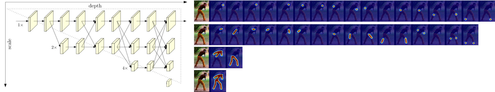
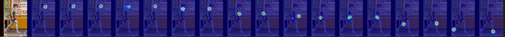
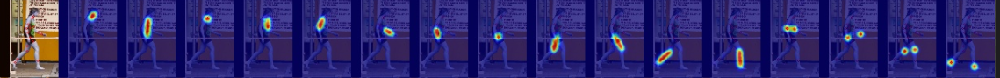
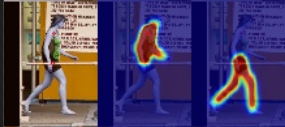
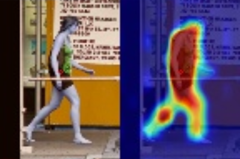

# HRNET with Skeletal heatmap

## Introduction
This is an pytorch implementation HRNet with skeletal heatmap. I am interested in semantic information of feature maps with each resolution in HRNet. So, I make ground truth heatmap of joints(default), skeletal, upper/lower and full body. Then, train the model while each predicted feature maps are trained with aforementioned GT heatmaps. The algorithm used to create heatmap referred to [Human Pose Estimation Using Skeletal Heatmaps
](https://ieeexplore.ieee.org/document/9306241). Implementation is only for COCO and HRNet (No ResNet & No MPII). 

### Results on COCO val2017 with detector having human AP of 56.4 on COCO val2017 dataset
| Arch               | Input size | #Params | GFLOPs |    AP | Ap .5 | AP .75 | AP (M) | AP (L) |    AR | AR .5 | AR .75 | AR (M) | AR (L) |
|--------------------|------------|---------|--------|-------|-------|--------|--------|--------|-------|-------|--------|--------|--------|
| **pose_hrnet_w48** |    384x288 | 65.4M   |   33.3 | pose_hrnet | 0.710 | 0.915 | 0.793 | 0.683 | 0.757 | 0.741 | 0.923 | 0.811 | 0.708 | 0.792 |

### Note:
- Flip test is used.
- Person detector has person AP of 56.4 on COCO val2017 dataset.
- GFLOPs is for convolution and linear layers only.

### Visualization

#### Visualizing results on COCO training
Keypoint Heatmap 
 
Skeletal Heatmap 
 
Half body Heatmap 
 
Full body Heatmap 

